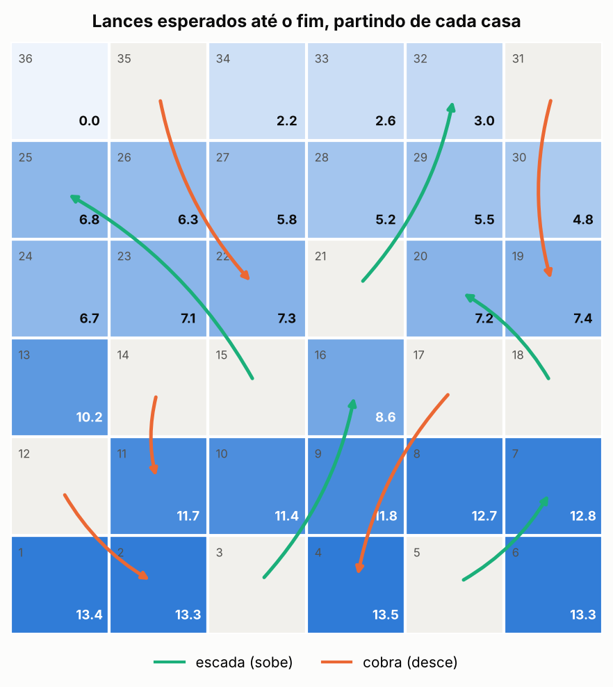
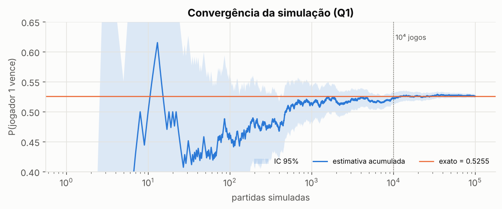
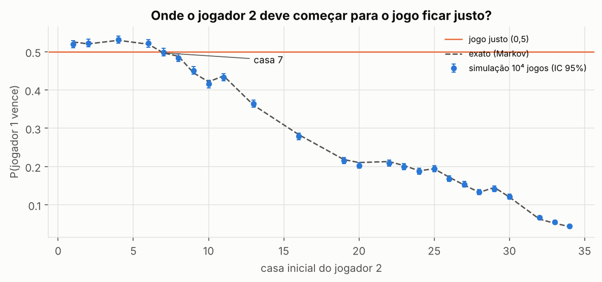
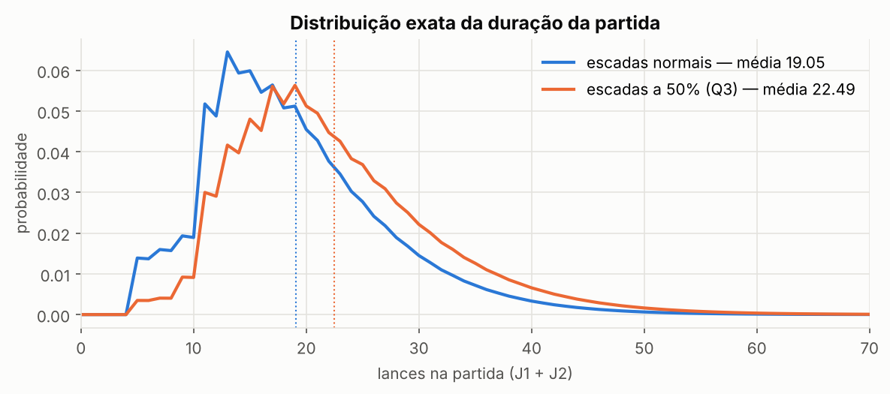

<div align="center">

# 🐍🪜 Cobras e Escadas: simulação × cadeia de Markov

**Quem começa tem vantagem? Quantas cobras se pisa por partida? Dá para deixar o jogo justo?**

Cinco perguntas sobre um tabuleiro 6×6, respondidas por dois métodos independentes que precisam concordar:<br>
uma **simulação de Monte Carlo** (10.000 partidas por cenário) e o **cálculo exato** por cadeia de Markov.

[](https://github.com/monteirocarloss021/snakes-and-ladders-markov/actions/workflows/ci.yml)




<sub>Número esperado de lances até o fim, partindo de cada casa (casas cinza são gatilhos: ninguém para nelas).</sub>

</div>

---

## Sumário

1. [Resultados](#resultados)
2. [O problema](#o-problema)
3. [Metodologia](#metodologia)
   - [Simulação de Monte Carlo](#1-simulação-de-monte-carlo)
   - [Solução exata por cadeia de Markov](#2-solução-exata-por-cadeia-de-markov)
   - [Validação cruzada](#3-validação-cruzada)
4. [Análise dos resultados](#análise-dos-resultados)
5. [Qualidade de software](#qualidade-de-software)
6. [Como usar](#como-usar)
7. [Estrutura do repositório](#estrutura-do-repositório)
8. [Limitações e extensões](#limitações-e-extensões)

---

## Resultados

| # | Pergunta | Simulação (10⁴ partidas, IC 95%) | Exato |
|:-:|---|:-:|:-:|
| 1 | Probabilidade de o jogador que começa vencer | 0,531 ± 0,010 | **0,5255** |
| 2 | Número médio de cobras por partida (dois jogadores) | 3,09 ± 0,05 | **3,094** |
| 3 | Lances por partida se cada escada só funciona com 50% de chance | 22,4 ± 0,2 | **22,49** |
| 4 | Casa inicial do jogador 2 que deixa o jogo mais equilibrado | casa 7 | **casa 7** (P = 0,4968) |
| 5 | P(jogador 1 vence) se o jogador 2 for imune à primeira cobra | 0,383 ± 0,010 | **0,3864** |

**Em uma frase cada:** começar dá 2,6 pontos percentuais de vantagem. Cada partida tem cerca de 3 cobras. Escadas falhando alongam o jogo em 18%. Começar o J2 na casa 7 equilibra a disputa. Uma única imunidade vale muito mais do que jogar primeiro.

---

## O problema

### Tabuleiro

Grade 6×6 numerada de 1 a 36 em zigue-zague, com cinco escadas e cinco cobras:

| Escadas (base → topo) | Cobras (cabeça → rabo) |
|:-:|:-:|
| 3 → 16 | 12 → 2 |
| 5 → 7 | 14 → 11 |
| 15 → 25 | 17 → 4 |
| 18 → 20 | 31 → 19 |
| 21 → 32 | 35 → 22 |

### Regras

- Dois jogadores começam na casa 1 e se alternam lançando um dado justo de 6 faces.
- Cair na **base de uma escada** leva ao topo. Cair na **cabeça de uma cobra** leva ao rabo.
- Vence quem **chegar ou passar** da casa 36.

### Hipóteses de modelagem

Onde o enunciado deixa margem, as escolhas foram explícitas:

| Ponto | Interpretação adotada |
|---|---|
| Ordem | O jogador 1 sempre joga primeiro. |
| Q2 – cobras | Soma das cobras dos **dois** jogadores na partida. |
| Q3 – lances | Total de lances da partida (J1 + J2). Para um jogador sozinho o valor seria 15,50. |
| Q3 – escada que falha | O jogador permanece na base da escada. |
| Q4 – casas candidatas | Ficam de fora as casas de base de escada e cabeça de cobra, onde uma peça nunca repousa. Começar na 5, por exemplo, é igual a começar na 7. |
| Q5 – imunidade | Ao cair na primeira cobra, o jogador 2 fica na cabeça dela e perde a imunidade. |

Todas as regras ficam em dois dicionários (`ESCADAS` e `COBRAS`) e numa dataclass `Regras`. Mudar o tabuleiro ou um cenário é mudar uma linha.

---

## Metodologia

A ideia central é **não confiar num único método**. A simulação é o que o enunciado pede, e o cálculo exato serve para provar que ela está certa.

```
             ┌──────────────────────┐
             │   tabuleiro + regras │
             └──────────┬───────────┘
          ┌─────────────┴─────────────┐
          ▼                           ▼
 ┌─────────────────┐         ┌─────────────────┐
 │  Monte Carlo    │         │ Cadeia de Markov│
 │  10⁴ partidas   │         │ cálculo exato   │
 │  + IC 95%       │         │ sem sorteio     │
 └────────┬────────┘         └────────┬────────┘
          └─────────────┬─────────────┘
                        ▼
              |z| < 3,5 em todas?  ──►  aprovado
```

### 1. Simulação de Monte Carlo

**Motor único.** A classe `Jogador` executa um lance (dado → escada/cobra → imunidade), e `jogar_partida` alterna os jogadores até alguém vencer. Os três cenários alternativos entram como parâmetros de `Regras(inicio_j2, p_escada, imunidade_j2)`, sem duplicar a lógica do jogo.

**Reprodutibilidade.** Cada cenário usa um gerador próprio com semente derivada de uma semente mestre. Os cenários ficam independentes entre si, e qualquer pessoa obtém exatamente os mesmos números.

**Incerteza.** Toda resposta vem com intervalo de confiança de 95%:

- **Proporções (Q1, Q4, Q5):** intervalo de Wilson, mais preciso que o normal perto dos extremos.

$$\tilde p \pm \frac{z}{1+z^2/n}\sqrt{\frac{\hat p(1-\hat p)}{n}+\frac{z^2}{4n^2}}, \qquad z = 1{,}96$$

- **Médias (Q2, Q3):** $\bar x \pm 1{,}96\, s/\sqrt n$.

**Q4 em duas etapas.** As casas 7 e 8 dão P(J1) de 0,4968 e 0,4881. A diferença (≈ 0,009) é menor que a margem de erro de 10⁴ partidas (≈ ± 0,010). Por isso, só com a triagem a casa escolhida trocava em cerca de 4 de cada 10 sementes testadas. A solução:

1. **Triagem:** 10⁴ partidas para cada casa candidata, todas com a **mesma semente** (números aleatórios comuns, que reduzem a variância das diferenças entre casas).
2. **Refinamento:** as casas compatíveis com 0,5 (|z| < 3) são re-simuladas com 2×10⁵ partidas no Python e 5×10⁵ no C++.

### 2. Solução exata por cadeia de Markov

A próxima casa de um jogador depende apenas da casa atual, então **cada jogador isolado é uma cadeia de Markov absorvente** (a casa 36 é o estado absorvente). Para a Q5, o estado ganha um bit: *(casa, imunidade já foi usada?)*, totalizando 74 estados.

A matriz de transição $P$ é montada percorrendo as 6 faces do dado a partir de cada casa. Propagando a distribuição inicial $v_0$ lance a lance ($v_{n+1} = v_n P$), obtêm-se para um jogador:

$$f_n = P(T=n), \qquad S_n = P(T>n), \qquad s_n = P(\text{cair em cobra no lance } n)$$

Os dois jogadores não interagem, então $T_1$ e $T_2$ são **independentes**, e cada pergunta vira uma soma:

| Pergunta | Expressão exata | Raciocínio |
|:-:|---|---|
| Q1, Q4, Q5 | $\displaystyle P(\text{J1}) = \sum_{n\ge1} f^{(1)}_n\, S^{(2)}_{n-1}$ | J1 termina no seu lance $n$ e o J2 ainda não terminou nos $n-1$ anteriores |
| Q2 | $\displaystyle \sum_{n\ge1} s^{(1)}_n S^{(2)}_{n-1} + s^{(2)}_n S^{(1)}_n$ | J1 joga o lance $n$ se $T_2 \ge n$; J2 joga o lance $n$ se $T_1 > n$ |
| Q3 | $\displaystyle \sum_{n\ge1} (2n-1)\, f^{(1)}_n S^{(2)}_{n-1} + 2n\, f^{(2)}_n S^{(1)}_n$ | a partida dura $2n-1$ lances se J1 vence no lance $n$, ou $2n$ se J2 vence |

**Truncamento.** As séries são somadas até $n = 4000$. A cauda decai como $\rho^n$, onde $\rho \approx 0{,}8125$ é o raio espectral da submatriz transiente. O erro é da ordem de $10^{-360}$, ou seja, nenhum.

**Conferência interna.** O tempo médio $E[T] = \sum_n S_n = 13{,}3826$ coincide com a soma da linha da casa 1 da matriz fundamental $(I-Q)^{-1}$. Esse é um teste automatizado.

### 3. Validação cruzada

Para cada pergunta, o programa calcula $z = (\hat\theta_{MC} - \theta_{exato}) / \text{erro padrão}$ e só termina com sucesso se $|z| < 3{,}5$ em todas.

Por que 3,5 e não 1,96? Com cinco comparações, um IC de 95% acusaria divergência por puro acaso em ~23% das execuções. Com 3,5, um alarme falso é raríssimo, e um erro real no código ainda é detectado com folga.

---

## Análise dos resultados

### 🎲 A vantagem de começar é exatamente metade da chance de empate

Por simetria, $P(T_1 < T_2) = P(T_2 < T_1)$. A única assimetria está no empate em número de lances, que quem joga primeiro sempre leva:

$$P(\text{J1 vence}) = \tfrac12 + \tfrac12\,P(T_1 = T_2) = \tfrac12 + \tfrac12 \sum_n f_n^2 = \tfrac12 + \tfrac12(0{,}0511) \approx 0{,}5255$$

Um jogador pode terminar em apenas 3 lances (1 → 3 ↗ 16 → 21 ↗ 32 → 36), o que acontece com probabilidade 1/72.

<p align="center"></p>

<p align="center"><sub>A estimativa acumulada oscila bastante até ~10³ partidas e estabiliza dentro de ±0,01 do valor exato a partir de 10⁴.</sub></p>

### ⚖️ Equilibrar o jogo pela casa inicial (Q4)

P(J1 vence) cai à medida que o J2 começa mais à frente e cruza 0,5 entre as casas 6 e 7. A curva não é monótona: começar na 11 é **pior** para o J2 do que na 10, porque da 11 três das seis faces caem em cobras (12, 14 e 17).

<p align="center"></p>

### 🛡️ Imunidade vale mais do que jogar primeiro (Q5)

Ignorar **uma** cobra derruba a chance do J1 de 52,6% para 38,6%. O tempo médio do J2 até terminar cai de 13,4 para 10,6 lances. A imunidade é gasta com mais frequência na cobra da 12 (26% das partidas), e em 24% das partidas nem chega a ser usada. As cobras mais caras são a da 35 (≈ 6,3 lances perdidos) e a da 17 (≈ 5,9).

### 🐢 Escadas pela metade (Q3)

Com escadas funcionando só 50% das vezes, a partida passa de 19,05 para 22,49 lances (+18%). Um jogador sozinho passa de 13,38 para 15,50. A distribuição também fica com a cauda mais pesada:

<p align="center"></p>

---

## Qualidade de software

| Prática | Como está implementada |
|---|---|
| **Testes** | 35 testes em `pytest`, cobrindo regras do jogo, propriedades da cadeia e concordância estatística |
| **Integração contínua** | GitHub Actions a cada push: lint → Python 3.10, 3.11, 3.12, 3.13 → C++ com g++ e clang++ |
| **Segurança de memória (C++)** | compilação com `-Wall -Wextra -Wpedantic -Werror` e execução sob AddressSanitizer + UBSan |
| **Estilo** | `ruff` (lint + formatação), `pre-commit` e `.editorconfig` |
| **Empacotamento** | `pyproject.toml`: instalável com `pip install -e .` e comando `cobras-escadas` |
| **Reprodutibilidade** | sementes fixas por cenário e figuras geradas por script |

O que os testes verificam:

- **Motor** (`test_motor.py`): cada escada sobe e cada cobra desce, passar de 36 vence, escada que falha mantém na base, a imunidade vale só para a primeira cobra e os jogadores se alternam corretamente. Usa um *dado roteirizado* (sequência fixa de lances) para não depender de sorteio.
- **Cadeia de Markov** (`test_markov.py`): a matriz de transição é estocástica, a distribuição de $T$ soma 1, $E[T]$ bate com $(I-Q)^{-1}$, vale a identidade $P(\text{J1}) = \frac12 + \frac12 P(T_1=T_2)$ e as cinco respostas batem com os valores de referência.
- **Simulação** (`test_simulacao.py`): reprodutibilidade por semente e concordância com o valor exato em todos os cenários.

---

## Como usar

### Instalação

```bash
git clone https://github.com/monteirocarloss021/snakes-and-ladders-markov.git
cd snakes-and-ladders-markov
pip install -e ".[dev,analise]"      # ou: make install
```

### Python

```bash
python python/cobras_escadas.py                                   # padrão: 10.000 partidas, semente 2026
python python/cobras_escadas.py --jogos 100000 --semente 7 --refino 500000
cobras-escadas --help                                             # mesmo programa, via entry point
python python/cobras_escadas_simples.py                           # versão enxuta e comentada
```

| Argumento | Padrão | Significado |
|---|:-:|---|
| `--jogos` | 10000 | partidas por cenário |
| `--semente` | 2026 | semente mestre |
| `--refino` | 200000 | partidas por finalista na 2ª etapa da Q4 |

### C++

```bash
make cpp-run                       # ou: g++ -std=c++17 -O2 -o cobras cpp/cobras_escadas.cpp && ./cobras
./cobras 100000 7                  # [partidas por cenário] [semente]
```

A versão C++ não tem dependências e roda as cinco perguntas, com validação, em ~0,3 s.

### Saída esperada

```
Testes do motor: OK
Monte Carlo: 10000 partidas/cenário, semente 2026

Q1 P(J1 vence)                       0.5308  [0.5210, 0.5406]   exato   0.5255  z=+1.06 ok
Q2 cobras/partida (J1+J2)             3.089  [3.038, 3.139]   exato    3.094  z=-0.20 ok
Q3 lances/partida (escada 50%)        22.39  [22.21, 22.56]   exato    22.49  z=-1.18 ok
   melhor casa: MC = 7 | exato = 7  ok
Q5 P(J1 vence), J2 imune             0.3828  [0.3733, 0.3924]   exato   0.3864  z=-0.74 ok

Validação MC x exato: TODAS OK
```

O processo termina com código `0` se tudo concordar e com `2` se houver divergência, o que permite usá-lo direto em CI.

### Comandos do Makefile

| Comando | Ação |
|---|---|
| `make test` | roda a suíte `pytest` |
| `make lint` / `make format` | checa / aplica o estilo com `ruff` |
| `make cpp-run` | compila e roda a versão C++ |
| `make sanitize` | compila o C++ com ASan + UBSan e roda |
| `make figures` | regenera as figuras deste README |

---

## Estrutura do repositório

```
snakes-and-ladders-markov/
├── python/
│   ├── cobras_escadas.py          # solução completa: motor, Monte Carlo, Markov, CLI
│   └── cobras_escadas_simples.py  # versão enxuta, comentada passo a passo
├── cpp/
│   └── cobras_escadas.cpp         # mesma solução em C++17, sem dependências
├── tests/                         # suíte pytest (motor, Markov, simulação)
├── notebooks/
│   └── analise.ipynb              # análise exploratória com gráficos
├── scripts/
│   └── gerar_figuras.py           # gera as figuras de figures/
├── figures/                       # imagens usadas neste README
├── .github/workflows/ci.yml       # lint + testes + C++ com sanitizers
├── pyproject.toml                 # metadados, dependências, ruff e pytest
└── Makefile                       # atalhos de desenvolvimento
```

---

## Limitações e extensões

- **Leitura do tabuleiro.** Escadas e cobras foram lidas de uma imagem. Se alguma casa estiver diferente, basta alterar `ESCADAS` e `COBRAS`: todo o resto, inclusive os testes de propriedade, se adapta.
- **Regra do final exato.** Muitas variantes exigem cair exatamente na última casa. Isso é uma mudança pequena, no motor e na matriz.
- **Q4 por otimização.** A busca atual testa todas as casas. Uma variação natural seria dar ao J2 uma vantagem contínua, como um lance extra com probabilidade $q$, e resolver $P(\text{J1}) = 0{,}5$ por bisseção sobre a solução exata.
- **Escala.** A solução exata custa $O(n_{\text{lances}} \cdot k^2)$ com $k = 74$ estados. Para tabuleiros 10×10 continua instantânea. Já a simulação em Python puro é o gargalo: com a mesma carga, a versão C++ é ~60× mais rápida.

---

<div align="center">

**Carlos Alberto Monteiro da Cunha** · Engenharia Civil-Aeronáutica · ITA<br>
[@monteirocarloss021](https://github.com/monteirocarloss021) · Licença [MIT](LICENSE)

</div>
